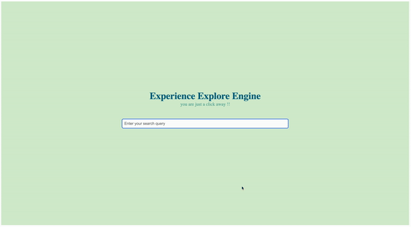

# Explore Engine is able to dynamically populate the list of strings from the store

<!-- TOC -->
* [Explore Engine is able to dynamically populate the list of strings from the store](#explore-engine-is-able-to-dynamically-populate-the-list-of-strings-from-the-store)
  * [explore-engine-server - Node JS](#explore-engine-server---node-js)
    * [Data Structures Used :](#data-structures-used--)
    * [Time Complexity :](#time-complexity--)
    * [Space Complexity :](#space-complexity--)
  * [explore-engine-view - React JS](#explore-engine-view---react-js)
    * [Optimization in the Front End](#optimization-in-the-front-end-)
<!-- TOC -->
---------

## explore-engine-server - Node JS
- explore-engine-server is a node js application build to handle the server side.
- It has a endpoint /words with query param "search" to fetch the words that matches the substring.

### Data Structures Used : 
- explore-engine-server uses trie Data Structure to store the words DB.
- explore-engine-server uses DFS to traverse the data structure to figure out the words.

### Time Complexity : 
- insertion => O(M)
- search => O(N * M)
where N is total no of Strings and M is the length of the strings

### Space Complexity : 
- Total Size => O(N * M)
where N is no of Strings and M is the length of the strings

------------

## explore-engine-view - React JS
- explore-engine-server is a react js application build to handle the front end.
- It has a search bar with list of sugesstions in the bottom div.

### Optimization in the Front End 
- we have introduced debounced search, instead of calling the API for every keyPress, we call the API when the timeout is reached.
- (or) user gives some time after continuous typing.
- which help us reduce the overload of network calls on the server.

### Input Validations
- we accept only alpha numeric values
- we expect a minimum of two letter code to invoke the api
- we dont accept special character
- we throw inline warning for such negative scenarios

------------
