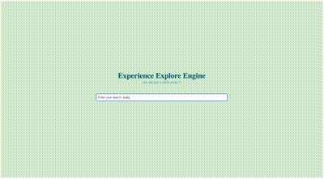

## Explore Engine is a suggestive search based

### explore-engine-server is a node js application for the backend

- To Build the docker image :
> docker build -t vijaykumar151096/explore-engine-server:elastic .

- To Run the docker image :
> docker run vijaykumar151096/explore-engine-server:elastic 

### explore-engine-view is a react js application for the frontend

- To Build the docker image :
> docker build -t vijaykumar151096/explore-engine-view:elastic .

- To Run the docker image :
> docker run vijaykumar151096/explore-engine-view:elastic

### Running the Entire Application : 

> docker-compose up 

application would be running on port : 3000

### Terminating the Entire Application :

> docker-compose down 

or 

> ctrl + c

Application would be running on port : 3000

To Populate the Elastic Search with default values for searching: 

> http://localhost:8080/words/populate

To Clean the values from mongoDB 

> http://localhost:8080/words/clean

**Elastic Search :** 

The elastic search is running on http://localhost:9200

**username :** elastic 

**password :** 1234

